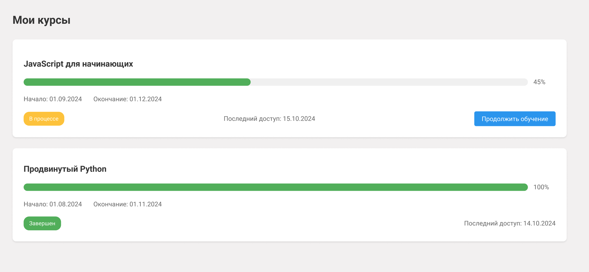
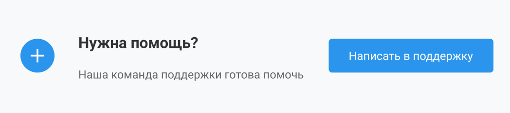

# ТЗ на страницу купленных курсов для front-end

## 1. Макеты страницы/функции/фичи





## 2. SEO

URL страницы: /courses

Хлебные крошки: Главная > Личный кабинет > Мои курсы

## 3. JSON при инициализации

```json
{
  "courses": [
    {
      "id": 1,
      "title": "JavaScript для начинающих",
      "progress": 45,
      "startDate": "2024-09-01",
      "endDate": "2024-12-01",
      "status": "in_progress",
      "lastAccessDate": "2024-10-15"
    },
    {
      "id": 2,
      "title": "Продвинутый Python",
      "progress": 100,
      "startDate": "2024-08-01",
      "endDate": "2024-11-01",
      "status": "completed",
      "lastAccessDate": "2024-10-14"
    }
  ]
}
```

## 4. Маппинг данных

### 4.1 Список курсов


Условие отображения: При наличии купленных курсов

| Элемент | Тип элемента | Поле из JSON | Примечание |
|---------|--------------|--------------|------------|
| Карточка курса | Container | courses[i] | Повторяющийся элемент для каждого курса |
| Название курса | Текст | courses[i].title | - |
| Прогресс прохождения | ProgressBar | courses[i].progress | Отображение в процентах |
| Дата начала | Текст | courses[i].startDate | Формат: DD.MM.YYYY |
| Дата окончания | Текст | courses[i].endDate | Формат: DD.MM.YYYY |
| Статус курса | Badge | courses[i].status | Цветовая индикация: in_progress - желтый, completed - зеленый |
| Дата последнего посещения | Текст | courses[i].lastAccessDate | Формат: DD.MM.YYYY |
| Кнопка "Продолжить обучение" | Button | - | Только для курсов со статусом in_progress |

### 4.2 Пустое состояние


Условие отображения: При отсутствии купленных курсов

| Элемент | Тип элемента | Поле из JSON | Примечание |
|---------|--------------|--------------|------------|
| Изображение | Image | - | Placeholder изображение |
| Текст "У вас пока нет курсов" | Текст | - | Статический текст |
| Кнопка "Перейти в каталог" | Button | - | Ведет на страницу каталога курсов |

### 4.3 Секция поддержки


Условие отображения: Всегда

| Элемент | Тип элемента | Поле из JSON | Примечание |
|---------|--------------|--------------|------------|
| Блок "Нужна помощь?" | Container | - | - |
| Кнопка "Написать в поддержку" | Button | personalChat | Открывает личный чат с поддержкой |

## 5. Действия на странице/в функции

| Действие | Формат вызова функции | Эндпоинт | Примечание |
|----------|----------------------|-----------|------------|
| Загрузка списка курсов | При монтировании компонента | GET /api/user/courses | - |
| Переход к курсу | Клик по кнопке "Продолжить обучение" | - | Редирект на /course/{courseId} |
| Открытие личного чата | Клик по кнопке "Написать в поддержку" | GET /api/personal-chat/{userId} | Открытие модального окна с чатом поддержки |